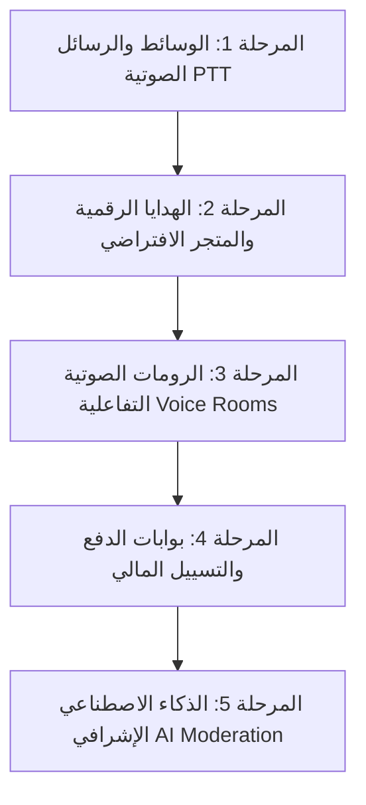

# وثيقة مواصفات وميزات نظام غرف الدردشة الجماعية والكتابية (ديوانية العراق) وخارطة الطريق المستقبلية
**Arabic Text Chat Rooms Platform - Comprehensive Features & Future Roadmap Specification**

---

## 📌 1. نظرة عامة على النظام (Executive Summary)

تم تصميم وبناء هذا المشروع وفقاً لأحدث معايير **Google MAD (Modern Android Development)** لخوادم المحادثات الفورية عالية الأداء، ليكون منصة دردشة عراقية وعربية متكاملة تشمل:
1. **تطبيق أندرويد للهواتف الذكية (Android Native Mobile App)** مبني بتقنية **Jetpack Compose Material 3** و **Clean Architecture** يدعم اتجاه الواجهة من اليمين لليسار (RTL) بشكل أصيل ويدعم التدوير في الوضعين الطولي والعرضي.
2. **سيرفر محادثات فورية Real-Time Backend** فائق السرعة مبني بـ **Node.js** و **Socket.io** مع تخزين دائم للرسائل وإدارة الجلسات والأجهزة المحظورة.
3. **لوحة تحكم مركزية خارجية (Standalone Web Admin Dashboard)** تعمل عبر متصفح الويب لإدارة مئات المستخدمين والغرف وإجراء العمليات الجماعية (Bulk Actions) دون الحاجة لفتح التطبيق.
4. **بوت مسابقات ذكي تفاعلي ("ست وداد 🤖")** يطرح أسئلة وألغاز تراثية عراقية ويكافئ الفائزين بالنقاط آلياً.
5. **مشغل وسائط يوتيوب عائم مدمج (In-Chat Floating YouTube Player)** يتزامن لحظياً بين جميع أعضاء الغرفة مع إمكانية تصغيره وإخفائه ومواصلة الدردشة أثناء الاستماع.

---

## 🚀 2. الميزات المنفذة حالياً وجاهزة للعمل 100% (Implemented Features)

### 🔹 أولاً: تطبيق الأندرويد (Mobile MAD Jetpack Compose App)

| الميزة | التفاصيل التقنية | حالة الميزة |
|---|---|---|
| **الهيكل المعماري (MAD Architecture)** | Kotlin Jetpack Compose + Clean Architecture + StateFlow + Kotlinx Coroutines. | مكتمل ✅ |
| **دعم RTL الكامل** | تخطيط عربي بالكامل مع محاذاة العناصر وفقاً للثقافة العراقية والعربية. | مكتمل ✅ |
| **الشريط العلوي الأزرق (Royal Blue Top Bar)** | شريط متدرج بارتفاع 54dp يحتوي 6 أزرار تفاعلية سريعة: الإشعارات، البريد الخاص، طلبات الصداقة، الملف الشخصي، قائمة المتصلين، و**درع لوحة الإدارة 🛡️**. | مكتمل ✅ |
| **شريط إعلان الغرفة (Room Topic Banner)** | شريط أزرق سماوي يعرض إعلان الغرفة الحالي مع زر مخصص لتشغيل أو إخفاء مشغل اليوتيوب `▶ يوتيوب / 📺 إخفاء`. | مكتمل ✅ |
| **مشغل يوتيوب العائم المدمج (Condition 6)** | نافذة مدمجة تعلو الرسائل مع عنوان المقطع، شارة يوتيوب، زر تصغير/تكبير، وزر إغلاق، تعمل عبر WebView IFrame API دون مقاطعة كتابة وقراءة الرسائل. | مكتمل ✅ |
| **فقاعات الرسائل المميزة (Message Bubbles)** | تصميم يحاكي BoomChat بفقاعات متباينة، توقيت دقيق `HH:mm` بأقصى اليسار، أفاتار بزوايا دائرية، ورتب الأعضاء. | مكتمل ✅ |
| **نظام تلوين الأسماء والرتب المخصص:** | • 👑 **المدير / المالك (Owner):** توهج ذهبي فخم (`#D4AF37`) وشارة التاج. • 🛡️ **المشرف (Moderator):** بنفسجي ملوكي وشارة الدرع. • 💎 **المميز (VIP Diamond):** تدرج وردي ماسي مع إمكانية تخصيص لون الاسم من 8 ألوان زاهية. • 👤 **العضو العادي (Regular):** ألوان افتراضية واضحة ومقروءة. • 🤖 **البوت (Bot):** تصميم سماوي ساطع خاص ببوت المسابقات ست وداد. | مكتمل ✅ |
| **النقر السريع للمنشن (Quick-Mention)** | النقر المباشر على أي فقاعة رسالة أو اسم عضو ينسخ اسمه فوراً في حقل الكتابة السفلي كـ `@الاسم:` للرد السريع دون عناء الكتابة اليدوية. | مكتمل ✅ |
| **درج المتصلين اللحظي (Online Users Drawer)** | قائمة جانبية منسحبة تعرض المتواجدين حالياً، مقسمين حسب رتبهم، مع مؤشرات الاتصال اللحظي وإمكانية بدء محادثة خاصة أو الإشراف بنقرة واحدة. | مكتمل ✅ |
| **لوحة الرموز التعبيرية (Emoji Grid & GIF Emoticons)** | شبكة متكاملة من الوجوه التعبيرية والملصقات العراقية المتحركة المدمجة داخل التطبيق. | مكتمل ✅ |
| **محادثات الخاص وصندوق الرسائل (Private Messages & Inbox)** | نافذة محادثة خاصة فورية بين أي عضوين مع أرشيف كامل للمحادثات السابقة، وصندوق بريد منظم يعرض آخر رسالة لكل محادثة. | مكتمل ✅ |
| **نظام طلبات الإضافة (Friend Requests)** | إمكانية إرسال واستقبال وقبول أو رفض طلبات الصداقة والإضافة بضغطة زر. | مكتمل ✅ |
| **الملف الشخصي وتخصيص المظهر (Profile Customizer)** | اختيار الأفاتار الشخصي من 8 شخصيات كرتونية وتخصيص لون الاسم للعضو المميز وحفظ الحالة (متصل، في الخارج، مشغول). | مكتمل ✅ |

---

### 🔹 ثانياً: سيرفر المحادثات الفورية والأمان (Node.js & Socket.io Backend)

| الميزة | التفاصيل التقنية | حالة الميزة |
|---|---|---|
| **اتصال فوري منخفض الكمون** | يعتمد على بروتوكول Socket.io مع النقل السريع عبر WebSockets وتأمين التوافقية عبر Polling. | مكتمل ✅ |
| **الحسابات والجلسات (Sessions & Auth)** | مصادقة آمنة مع تجزئة كلمات المرور عبر Salt + SHA-256، وإصدار رموز جلسات مشفرة (Auth Tokens) تحفظ الجلسة في الهاتف لمنع تكرار طلب الدخول. | مكتمل ✅ |
| **مانع السبام الصارم (Anti-Spam Engine)** | منع إرسال أكثر من رسالة خلال ثانيتين، وحظر الرسائل المتكررة فوراً، وكتم العضو تلقائياً في حال محاولة إغراق الروم برزم سريعة (<800ms). | مكتمل ✅ |
| **فلترة المحتوى والروابط وأرقام الهواتف** | كشف ومنع الروابط الخارجية الإعلانية، أرقام الهواتف، والشتائم تلقائياً مع تنبيه المستخدم بسبب المنع. | مكتمل ✅ |
| **وضع الشبح (Ghost Mode / Silent Shadowban)** | حظر صامت للأعضاء المشاغبين؛ يستمر المخرب في رؤية رسائله مرسلة بشكل طبيعي لتهدئته، بينما تُحجب تماماً عن جميع أعضاء الغرفة الآخرين ولا تُحفظ في السجلات. | مكتمل ✅ |
| **حظر عتاد الجهاز الفيزيائي (Hardware Device Ban)** | حظر الجهاز بواسطة معرّف العتاد الصارم (Hardware UUID). يُمنع الهاتف من الاتصال كلياً حتى لو أنشأ حسابات جديدة أو غيّر اسمه. | مكتمل ✅ |
| **كشف الحسابات البديلة (Alt-Accounts Detection)** | ربط جميع الحسابات المسجلة من نفس الجهاز تلقائياً، مع سجل بالأسماء القديمة التي استخدمها نفس الجهاز لعرضها على المشرفين. | مكتمل ✅ |
| **نظام الغرف المتعددة (5 Default Rooms)** | دعم 5 غرف افتراضية دائمة: (ديوانية العراق، ألعاب ومسابقات، شباب وبنات، شات بغداد، تعارف ولقاء الأحبة) مع استقلالية رسائل ومتصلي كل غرفة. | مكتمل ✅ |
| **حفظ دائم للسجلات (Persistent Storage)** | حفظ رسائل الشات العام والخاص، الحسابات، الأجهزة المحظورة، وأسماء الأعضاء في مخزن JSON مهيكل وسريع. | مكتمل ✅ |
| **جاهزية إشعارات الدفع (FCM Push Notifications)** | محرك إشعارات متكامل عبر Firebase Cloud Messaging لتنبيه المستخدم بالرسائل الخاصة والإعلانات العامة في حال كان التطبيق مغلقاً. | مكتمل ✅ |

---

### 🔹 ثالثاً: بوت المسابقات العراقي التفاعلي ("ست وداد 🤖")

| الميزة | التفاصيل التقنية | حالة الميزة |
|---|---|---|
| **الهوية والشخصية** | شخصية "ست وداد 🤖" التراثية اللطيفة، تظهر برتبة `BOT` ولون سماوي مميز في قائمة المتصلين والغرف. | مكتمل ✅ |
| **بنك الأسئلة والألغاز** | مجهز بـ 12 لغزاً وسؤالاً تراثياً عراقياً يشمل معالم بغداد، المحافظات، الأكلات الشعبية، وترتيب الحروف المبعثرة. | مكتمل ✅ |
| **المراقبة اللحظية والتقييم الآلي** | مراقبة فورية لرسائل الشات العام، مع معالجة ذكية للأحرف (إزالة التشكيل وتوحيد الألف والهمزات والتاء المربوطة). | مكتمل ✅ |
| **التهنئة واحتساب النقاط** | عند كتابة الجواب الصحيح من أي عضو، يُعلن البوت فوزه فوراً بمنشن `@الاسم` ويمنحه **10 نقاط 🏆** مع ذكر مجموع نقاطه، ويغلق السؤال لمنع التكرار. | مكتمل ✅ |
| **الطلب عند الحاجة** | يمكن للمشرفين والمدير إطلاق مسابقة فورية في أي وقت من لوحة الإدارة أو بكتابة أمر `/quiz`. | مكتمل ✅ |

---

### 🔹 رابعاً: لوحة التحكم المركزية وأوامر الإدارة (Admin Ecosystem)

#### 1. لوحة الإدارة داخل التطبيق (In-App Admin Dialog):
* أيقونة درع بارزة في الشريط العلوي للمشرفين والمدير (`OWNER` و `MODERATOR`).
* خيارات فورية: قفل الشات العام، قفل الخاص، إرسال برودكاست عام، قائمة المشرفين وتنزيل الرتب، طرح مسابقة، وفك حظر الأجهزة.
* نافذة إشراف العضو الفردية: فك كتم، كتم، وضع الشبح، طرد، حظر جهاز، وترقية فورية لمشرف أو مميز.

#### 2. لوحة التحكم المركزية الخارجية عبر الويب (Standalone Web Admin Dashboard):
* **الرابط:** تعمل عبر المتصفح على الرابط `http://localhost:3001/admin`.
* **التحكم المتعدد بالأعضاء (Multi-User Bulk Management):**
  * تحديد أكثر من مستخدم معاً (Select All / Multi-Checkboxes).
  * شريط إجراءات جماعي:
    * 🔊 **فك كتم المحددين دفعة واحدة**
    * 🔇 **كتم المحددين دفعة واحدة**
    * 🚪 **طرد المحددين من الغرف دفعة واحدة**
    * 👻 **تفعيل وضع الشبح للمحددين**
    * 💎 **ترقية المحددين إلى رتبة VIP Diamond**
    * 👤 **تنزيل المحددين إلى أعضاء عاديين**
* **التحكم بالغرف:** متابعة المتصلين بكل غرفة، تبديل قفل الشات العام والخاص، وتعديل إعلانات الرومات.
* **لوحة المتصدرين:** جدول بأكثر الأعضاء حصداً للنقاط في مسابقات البوت.
* **إدارة الأجهزة المحظورة:** فك حظر أي جهاز محظور بنقرة زر.
* **موجه الأوامر الإدارية (CLI Terminal):** كتابة وتنفيذ الأوامر البرمجية من المتصفح مباشرة.

#### 3. أوامر الشات الإدارية المباشرة (In-Chat Slash Commands):
يتيح للمشرفين والمدير كتابة الأوامر مباشرة داخل خانة كتابة الرسائل:
* `/help` أو `/اوامر` — استعراض الأوامر.
* `/mute <اسم>` — كتم عضو.
* `/unmute <اسم>` — فك كتم وتفعيل عضو.
* `/ghost <اسم>` — تفعيل الشبح.
* `/unghost <اسم>` — إلغاء الشبح.
* `/kick <اسم>` — طرد عضو وفصله فوراً.
* `/ban <اسم>` — حظر عتاد الجهاز نهائياً.
* `/promote <اسم> <رتبة>` — ترقية رتبة العضو.
* `/quiz` — طرح سؤال مسابقة فوراً.
* `/broadcast <نص>` — إرسال إشعار عام للجميع.
* `/lock public on|off` — قفل أو فتح العام.
* `/lock private on|off` — قفل أو فتح الخاص.
* `/topic <نص>` — تغيير إعلان الغرفة.

---

## 🔮 3. الميزات المستقبلية وخارطة طريق التطوير المتقدم (Future Roadmap)

إذا رغب العميل في تطوير النظام لمستويات متقدمة تضاهي تطبيقات مثل (Yalla, Olla, Clubhouse, Discord)، فهذه أبرز الميزات المخططة هندسياً:

### 🎙️ 1. تسجيل وإرسال الرسائل الصوتية (Voice Notes / Push-to-Talk)
* تسجيل مقاطع صوتية مباشرة عبر الضغط المطول على زر المايكروفون.
* ضغط الصوت بصيغة `Opus / AAC` خفيفة الحجم لضمان الإرسال السريع حتى في شبكات 3G/4G الضعيفة.
* مشغل صوتي مدمج داخل فقاعة الرسالة مع موجات صوتية متحركة (Waveforms).

### 📸 2. إرسال الصور ومقاطع الفيديو المشفرة (Rich Media Attachments)
* إرسال الصور المصغرة مع الحماية من المحتوى الحساس عبر مكتبة الفحص الآلي.
* تخزين سحابي للوسائط عبر AWS S3 أو Cloudflare R2 مع توليد روابط مؤقتة آمنة (Signed URLs).
* معاينة الصور داخل الشات بملء الشاشة مع إمكانية التكبير والحفظ.

### 🎁 3. نظام الهدايا الرقمية والمتجر الافتراضي (Virtual Gifts & Digital Economy)
* إرسال هدايا متحركة (ورود 🌹، سيارات 🚗، تيجان 👑، قلاع 🏰) تظهر بمؤثرات متحركة ملء الشاشة (Lottie Animations).
* محفظة رقمية للكوينز (Coins Wallet) لكل مستخدم مع رصيد نقاط يُجمع من المسابقات أو الشحن.
* متجر لشراء إطارات الصور، ألوان الأسماء الفاخرة، والفقاعات المزخرفة.

### 📻 4. الرومات الصوتية الجماعية المباشرة (Live Audio Voice Rooms)
* تمكين أعضاء الغرفة من الصعود على "المايكروفون" (Mic Seats) والتحدث الصوتي المباشر بتقنية **WebRTC / Agora**.
* إشراف على المايكات: كتم المايك، إنزال العضو، ومنح دور التحدث.
* مستمعون غير محدودين مع الحفاظ على الدردشة الكتابية مستمرة في الأسفل.

### 💳 5. بوابات الدفع الإلكتروني والتسييل المالي (Monetization Gateways)
* ربط بوابات الدفع المعتمدة في العراق والوطن العربي:
  * **زين كاش (ZainCash)**
  * **آسيا حوالة (AsiaHawala)**
  * **كي كارد (Qi Card)**
  * **Google Play In-App Billing** للاشتراكات وشحن الكوينز الدولي عبر الفيزا والماستركارد.
* اشتراكات عضوية VIP شهرية وسنوية تمنح ميزات حصرية.

### 🛡️ 6. نظام الذكاء الاصطناعي للإشراف الآلي (AI-Powered Content Shield)
* فلترة النصوص والرسائل باستخدام نماذج معالجة اللغة الطبيعية (NLP) لكشف التنمر، والتحرش، والتحايل الإملائي.
* كشف تلقائي للـ VPN والبروكسيات المشبوهة وحظرها لمنع تكرار الإزعاج.
* حظر جغرافي (Geo-IP Blocking) اختياري لحصر الدخول في دول معينة.

---

## 📊 4. جدول المقارنة وتكامل النظام (Verification & Status Matrix)

| المحور | عدد الميزات المنفذة | حالة الفحص الآلي | مسار الكود |
|---|---|---|---|
| **تطبيق الأندرويد MAD** | 12 ميزة | تجميع ناجح 100% (`BUILD SUCCESSFUL in 11s`) | `android_app/app/src/main/java/` |
| **سيرفر المحادثات والأمان** | 11 ميزة | 33/33 اختبار e2e أخضر (`test_flow.js`) | `server/server.js`, `server/lib/` |
| **لوحة الإدارة والإشراف** | 7 ميزات | تعمل وتستجيب لحظياً على المنفذ `3001` | `server/public/admin/`, `admin_api.js` |
| **بوت المسابقات الذكي** | 4 ميزات | تم التحقق مع احتساب النقاط التلقائي | `server/lib/bot.js` |
| **حزمة التطبيق الجاهزة APK** | جاهز للتثبيت | 19.4 MB محدث بتاريخ اليوم | `/sdcard/Download/ali-chat-debug.apk` |

---
**تاريخ التوثيق:** 16 سبتمبر 2026  
**الجهة المطورة:** فريق التطوير البرمجي المتقدم - Google MAD & Real-Time Architecture
