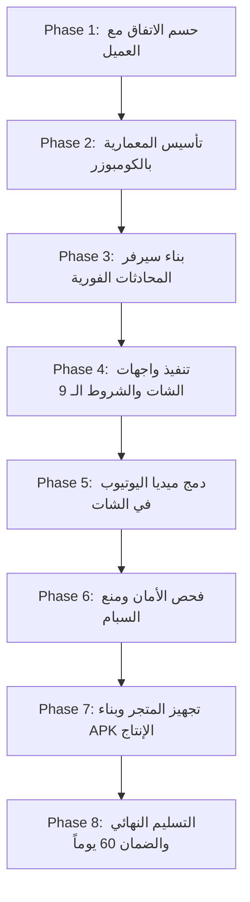

# خطة تنفيذ مشروع تطبيق غرف الدردشة الجماعية والكتابية للأندرويد

## 🎯 Goal Description
تطوير وتسليم تطبيق أندرويد متكامل لنظام غرف الدردشة الجماعية والكتابية (Arabic Text Chat Rooms App) للعميل **علي ع.** تلبيةً لكافة شروطه الـ 9 بدقة، بالاعتماد على معمارية Google MAD الحديثة (Kotlin Jetpack Compose Material 3 Clean Architecture) وسيرفر محادثات فورية Real-time Socket.io، مع تجهيز خطة التكاليف والاشتراكات ومساعدة العميل في متجر Google Play وضمان دعم فني لمدة 60 يوماً.

---

## ⚠️ User Review Required

> [!IMPORTANT]
> **1. حساب مطور Google Play Console ($25):**
> يجب أن يفتحه العميل باسمه الشخصي وببطاقته البنكية لضمان بقاء ملكية التطبيق القانونية له وحماية حساب المطور الخاص بك. سيتم إعطاء العميل دليلاً مبسطاً لفتحه خلال 10 دقائق، أو تسليمه ملف APK مباشر كخيار بديل فوري إذا رغب في تأجيل فتح الحساب.

> [!TIP]
> **2. سيرفر استضافة الشات (Cloud VPS):**
> خادم Socket.io يتطلب استضافة سحابية خفيفة بنظام لينكس (تكلفة $4.50 - $6.00 شهرياً عبر Hetzner CX22 أو Contabo). يتحمل السيرفر آلاف المستخدمين المتزامنين باستهلاك موارد بسيط.

> [!NOTE]
> **3. سعر العرض المقترح على مستقل:**
> تم تحديد سعر العرض بـ **110$** لكسر حاجز الـ 150$ التي اشتكى منها العميل، مع الحفاظ على هامش ربح ممتاز للمطور (أكثر من 90% صافي).

---

## ❓ Open Questions
* هل تفضل البدء بتأسيس كود الأندرويد فوراً باستخدام الكومبوزر `composer_ultimate_starting_mystro.py` ليكون جاهزاً كمعاينة حية للعميل؟
* هل يريد العميل تسمية معينة للتطبيق وشعاراً محدداً أم نقترح له اسماً عربياً جذاباً مثل "شات الخليج" أو "ديوانية العرب"؟

---

## 💰 الفاتورة المتوقعة والاشتراكات المطلوبة

### جدول الاشتراكات والمصاريف:
| البند | التكلفة | الجهة | المسؤولية |
|---|---|---|---|
| **أتعاب التطوير والبرمجة** | **$110.00** | منصة مستقل | تدفع للمطور وتظل في ضمان المنصة لحين الاستلام |
| **حساب Google Play Console** | **$25.00** | Google | يدفعها العميل مرة واحدة بالفيزا لامتلاك حسابه الرسمي |
| **سيرفر الاستضافة Cloud VPS** | **$4.50 - $6.00 / شهرياً** | Hetzner / Contabo | يدفعها العميل شهرياً لمزود السيرفر |
| **Firebase Cloud Messaging** | **$0.00** | Google Firebase | مجاني تماماً لبث الإشعارات الفورية للأعضاء |
| **مشغل يوتيوب المدمج** | **$0.00** | YouTube API | مجاني ومدمج داخل الشات بدون تكاليف إضافية |
| **إجمالي استثمار العميل الأولي:** | **~$135.00** | أتعاب المطور + رسوم جوجل + أول شهر استضافة |

---

## 🚀 الخطة التنفيذية مرحلة تلو الأخرى (Phases)



### 🔹 المرحلة الأولى (Phase 1): حسم الاتفاق مع العميل علي ع.
- إرسال نص الرسالة التوضيحية المقنعة له.
- تعديل قيمة العرض إلى 110$ وقبول العميل للبدء.
- اعتماد اسم التطبيق المبدئي وقائمة الغرف الأساسية.

### 🔹 المرحلة الثانية (Phase 2): التأسيس المعماري عبر الكومبوزر
- استخدام `composer_ultimate_starting_mystro.py` لتوليد هيكل Jetpack Compose Clean Architecture.
- تجهيز طبقة البيانات والمودلز:
  - `ChatMessage` (نص، توقيت، مرسل، لون مخصص، حالة الشبح).
  - `ChatUser` (رتبة: عادي، مميز 💎، مشرف، مدير، لون، معرّف الجهاز).
  - `ChatRoom` (اسم الغرفة، قفل العام، قفل الخاص، قائمة المتصلين).

### 🔹 المرحلة الثالثة (Phase 3): سيرفر المحادثات الفورية والحماية
- بناء خادم Node.js مع Socket.io و Express و SQLite/PostgreSQL.
- برمجة أحداث الغرف المتزامنة والبث اللحظي.
- برمجة ميزة **وضع الشبح (Ghost Mode)**: توجيه رسائل المخرب لنفسه فقط دون أن يراها باقي أعضاء الغرفة.
- برمجة محرك الحظر الصارم بواسطة معرّف الجهاز الفيزيائي (Hardware UUID) وحساب Google.

### 🔹 المرحلة الرابعة (Phase 4): تنفيذ واجهات الشات والشروط الـ 9 بدقة
تحليل الواجهة المطلوبة (من مواصفات العميل والصورة):
* **1. الشريط العلوي الأزرق (Royal Blue Top App Bar):**
  - شريط أزرق احترافي بارتفاع 56dp يحتوي 5 أزرار سريعة:
    - 🔔 الإشعارات (Notifications)
    - 🚪 قائمة الغرف (Room Switcher)
    - 👤 الملف الشخصي (Profile)
    - ✉️ البريد والخاص (Private Messages)
    - 👥 الطلبات (Friend/Room Requests)
* **2. فقاعات الرسائل والأفاتار (Message Bubbles & Avatars):**
  - **الأفاتار:** مربع بزوايا دائرية (Rounded Square - 42dp × 42dp مع CornerRadius 10dp).
  - **فقاعة الرسالة:** مستطيلة بزوايا دائرية ناعمة (Card with 12dp rounded corners)، خلفية بيضاء مائلة للفضي الخفيف.
  - **التوقيت:** يظهر دائماً في أقصى اليسار بتنسيق `HH:mm` بخط صغير رمادي واضح.
  - **اسم العضو والرتبة:** في بداية الفقاعة مع علامة الرتبة ولون الاسم المخصص.
* **3. نظام ألوان الرتب المخصص:**
  - 👑 **المدير / صاحب الروم:** خط واضح بلون ذهبي متوهج فاخر مع حدود سوداء أنيقة.
  - 🛡️ **المشرف / الإدارة:** لون فضي ملكي / رمادي فخم وثابت.
  - 💎 **العضو المميز:** علامة الألماس بجانب الاسم مع تفعيل ميزة اختيار لونه المفضل من شاشة البروفايل.
  - 👤 **العضو العادي:** لون افتراضي ثابت ويدخل بحالة كتم تلقائي لحين الموافقة.
* **4. الحقل السفلي وميزة النقر السريع (Bottom Input & Quick Mention):**
  - حقل كتابة ممتد ومرن، زر الرموز التعبيرية (Emoji Picker)، زر إرفاق وسائط (Attachments)، وزر الإرسال.
  - ميزة **النقر السريع على اسم العضو:** بمجرد الضغط على اسم أي مرسل في الشات، يُنسخ اسمه فوراً في خانة الكتابة السفلية مثل `@أحمد:` للرد السريع عليه.
* **5. قائمة المتصلين الجانبية (Online Users Drawer):**
  - قائمة تنسحب من اليمين أو تنبثق بنقرة زر، تعرض كافة المتواجدين في الروم مع رتبهم وحالتهم اللحظية.
* **6. مشغل ميديا يوتيوب المدمج (In-Chat YouTube Screen):**
  - نافذة مشغل مصغرة ومتحركة أعلى الشات يمكن إخفاؤها وتكبيرها للاستماع والمشاركة أثناء الدردشة.

### 🔹 المرحلة الخامسة (Phase 5): دمج ميديا اليوتيوب في الشات
- دمج مشغل يوتيوب مصغر أعلى نافذة الدردشة عبر WebView IFrame API.
- إمكانية استماع ومشاركة المقاطع أثناء مواصلة كتابة وقراءة رسائل الشات.

### 🔹 المرحلة السادسة (Phase 6): فحص الأمان ومنع السبام
- تفعيل مانع السبام (Anti-Spam RateLimiter) بمهلة 2 ثانية بين كل رسالة وأخرى ومنع التكرار.
- فحص الأمان عبر `ci_gate.sh` وبناء نسخة APK إنتاجية موقعة.
- اختبار الحظر وكشف الحسابات البديلة على نفس الجهاز.

### 🔹 المرحلة السابعة (Phase 7): مساعدة العميل في حساب المتجر
- توجيه العميل خطوة بخطوة لفتح حساب Google Play Console ودفع الـ 25$.
- إعداد لقطات الشاشة، الأيقونات الرسمية (512x512)، وسياسة الخصوصية.
- رفع ملف الحزمة (AAB) للمراجعة الرسمية.

### 🔹 المرحلة الثامنة (Phase 8): التسليم النهائي وضمان الـ 60 يوماً
- تسليم السورس كود الكامل مع مستودع GitHub خاص.
- تسليم دليل تشغيل السيرفر خطوة بخطوة.
- بدء سريان الدعم الفني المجاني لمدة شهرين لحل أي أخطاء.

---

## 🛠️ Proposed Changes

### 1. مجلد المشروع والملفات المرجعية
#### [NEW] `projects/client_ali_text_chat/TEXT_CHAT_PLAN.md`
وثيقة الخطة الشاملة باللغة العربية متضمنة الجداول والتكاليف.

#### [NEW] `projects/client_ali_text_chat/TEXT_CHAT_PLAN.json`
بيانات الخطة المهيكلة بصيغة JSON لربطها بالأنظمة والسكربتات.

#### [NEW] `projects/client_ali_text_chat/android_app/`
مشروع أندرويد MAD الكامل المولد عبر `composer_ultimate_starting_mystro.py`.

#### [NEW] `projects/client_ali_text_chat/server/`
خادم Node.js / Socket.io وقواعد بيانات المحادثات والحظر ووضع الشبح.

---

## 🧪 Verification Plan

### الفحص الآلي
```bash
# التأكد من سلامة كود أندرويد وخلوه من أخطاء التجميع
cd projects/client_ali_text_chat/android_app && ./gradlew assembleDebug

# فحص الثغرات الأمنية وسياسات الاعتماديات
PROJECT_DIR=$PWD/projects/client_ali_text_chat platform/scripts/ci_gate.sh
```

### الفحص اليدوي
1. تشغيل السيرفر وتوصيل هاتفين أندرويد عبر ADB.
2. التحقق من وصول الرسائل فورياً بزمن أقل من 100ms.
3. تجربة وضع الشبح (Ghost Mode) والتأكد أن العضو المخرب يرى رسالته وحده وتختفي عن الهاتف الآخر.
4. تجربة حظر الجهاز والتأكد من رفض تسجيل الدخول حتى لو تم تغيير الاسم.
5. تجربة مشغل اليوتيوب المدمج والتأكد من استمرار الصوت أثناء الدردشة.
